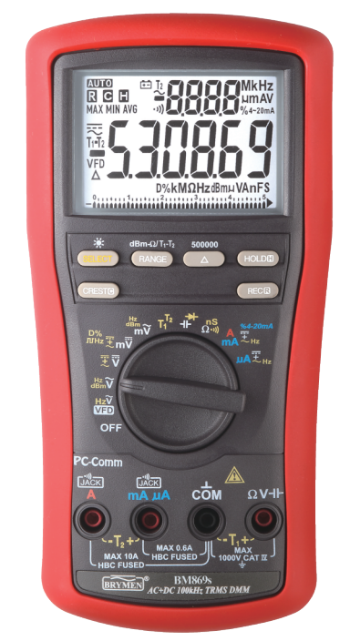

# Brymen869s-XmlLib

## Dependencies

* [Ahid library](http://ahidlib.com/pages/programming_cpp.php?lang=en) - USB HID device driver for Windows.

* [TinyXml2](https://github.com/leethomason/tinyxml2) - c++ xml parser. 

## Usage

**Lib(x86)** contains all needed files to use Brymen869s-XmlLib for 64-bit Windows 64.

**Docs** contains information details about communication with digital multimeter. 

Header file have 3 functions declaration. If you want to start read data you have to call Brymen_start() then communication will be open. 
Brymen_registerCallback allow you to read data that are displayed on the screen (only if you called Brymen_start()). 
You can pass your function as a parameter then you will be able to do anything you want with readed measurements.
Brymen_end() turns off connection. 
