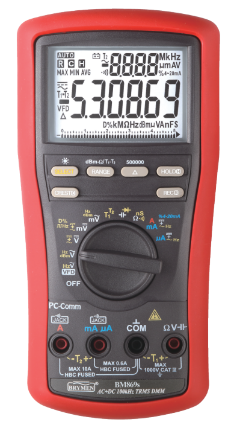

# Brymen869s-XmlLib

<<<<<<< HEAD
=======

>>>>>>> testing
## Usage

Lib(x86) contains all needed files to use Brymen869s-XmlLib on Windows 64 bit system.

OthDocs contains information details about communication with digital multimeter. 

<<<<<<< HEAD
=======

>>>>>>> testing
## Dependencies

* [Ahid library](http://ahidlib.com/pages/programming_cpp.php?lang=en) - a straight forward API of only eight functions allows you to connect your USB HID device with a Windows PC.

* [TinyXml2](https://github.com/leethomason/tinyxml2) - is a simple, small, efficient, C++ XML parser. 

<<<<<<< HEAD
=======

>>>>>>> testing
## Brymen869.h

Header file have 3 functions declaration. If you want to start read data you have to call Brymen_start() then communication will be open. 
Brymen_registerCallback allow you to read data that are displayed on the screen (only if you called Brymen_start()). 
You can pass your function as a parameter then you will be able to do anything you want with readed measurements.
Brymen_end() turns off connection. 
